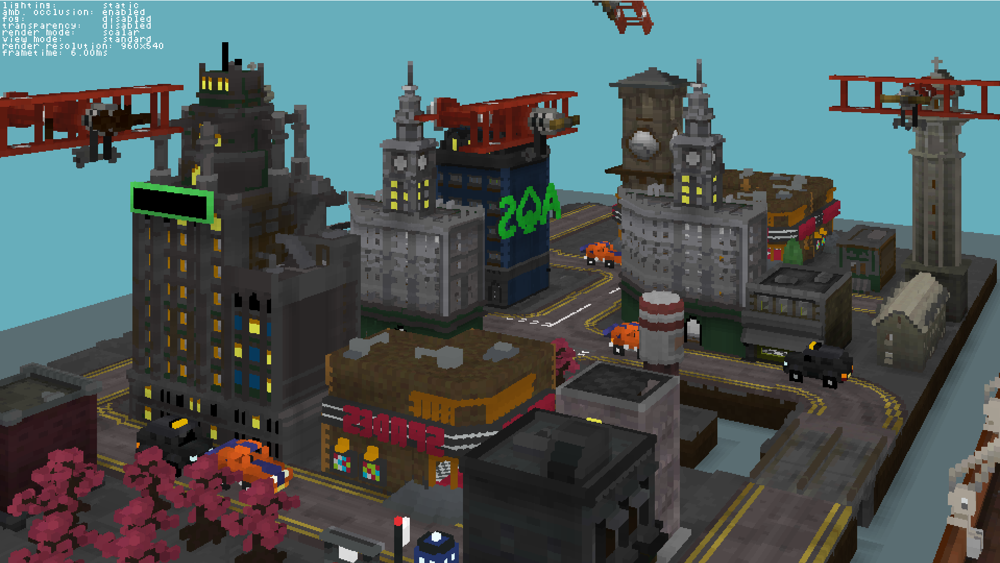
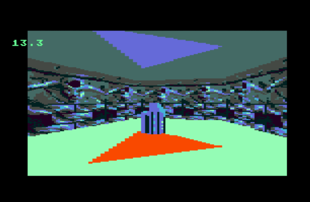
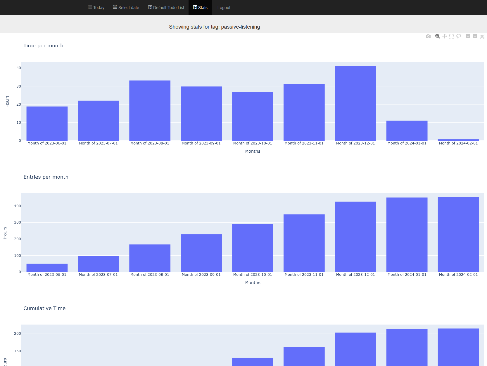

# Erik Haliewicz's personal github page.

# Projects

## Voxel renderer (2023-current)

### A CPU powered (no GPU!) 5DOF voxel renderer, supporting transparency and deferred lighting, using cached-based optimizations and AVX2.

### [Source code](https://github.com/ehaliewicz/voxel).

#### A foggy morning on rocket island

#### Voxel city

## Manifold (2020-current)

### A project to create an advanced 2.5D Graphics engine and map creation toolkit, for Sega Megadrive/Genesis.

### [Source code](https://github.com/ehaliewicz/manifold).

#### A dark hallway

#### A key in the room beyond

## Language Immersion Time Tracker (2022-2023)

### I was dissatisfied with existing tools for time tracking, so I decided to make my own.  Can be used for any kind of time tracking, but specifically tuned for my language learning needs.

### The backend is powered by python, django and postgres.  For the frontend, I avoided typescript, using javascript, preact, and htm so no builds were required and page load times were kept minimal.  

### This project does just about everything I need now, and is no longer under active development, aside from rare bugfixes.

### [Source code](https://github.com/ehaliewicz/time-tracker).

#### Daily todo list UI

#### Stats UI

